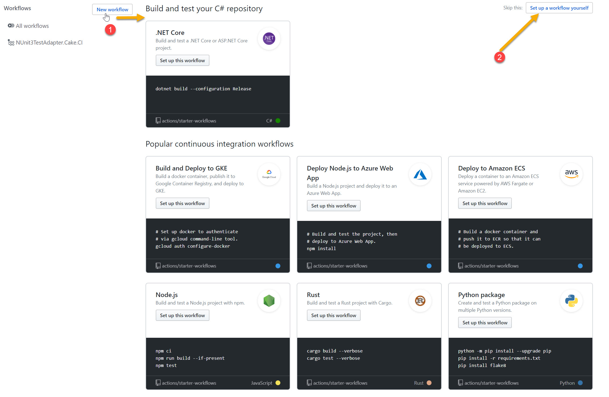
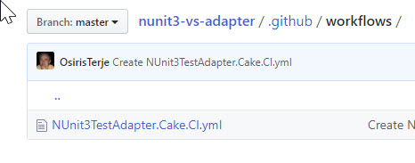
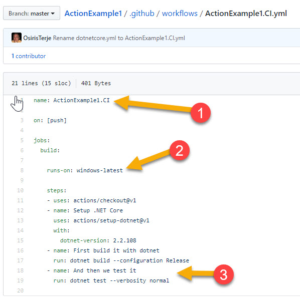
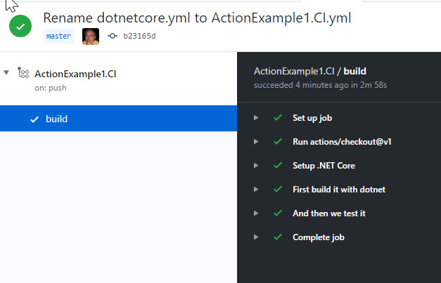
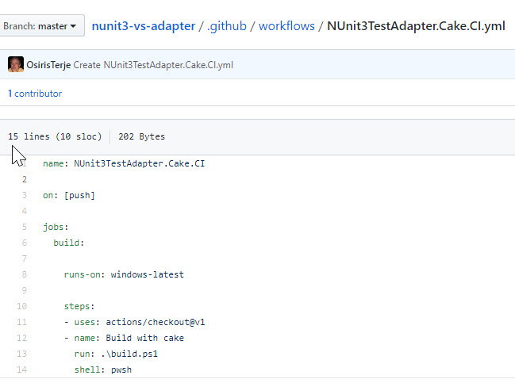
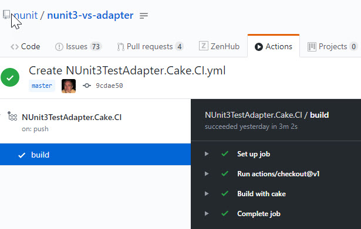

<!-- Github Actions released, and some specifics for .Net Framework  -->

## Summary

Github Actions has been released for public use, and announced at the [Github Universe conferense](https://githubuniverse.com/) in San Franciso Nov. 13th. And, because Github loves open source - it is fully free for all public repositories!

[Github Actions](https://github.com/features/actions) can be used for automating a series of processes, as it can utilize most of the [events](https://help.github.com/en/actions/automating-your-workflow-with-github-actions/events-that-trigger-workflows) in the github system.  The most typical use will still be to trigger CI/CD builds.  The whole system is yaml based, and it can run on different environments, Linux, Windows and MacOS.

There also is a [marketplace](https://github.com/marketplace?type=actions) where you can find a lot of community contributed actions to be used in your workflow.

There are also a series of starter workflows which you can just use for your first builds.  As they are written in yaml, they are easy to customize to your needs.  A good introduction to yaml can be found [here](https://www.codeproject.com/Articles/1214409/Learn-YAML-in-five-minutes).
When you press New Workflow on the Actions page ((1) in screenshot below), you get a list of proposals, or you can start out blank ((2) in screenshot below)

## Locations of the yaml files

If you add a github action for the first time using the web interface, you will see that the file is placed in the .github/workflows folder.

Note that if want to edit this file locally, you need to have a SSH enabled local repo.  See [Connecting to GitHub with SSH](https://help.github.com/en/github/authenticating-to-github/connecting-to-github-with-ssh)

## Examples of yaml files for some Github Actions

### .Net Core example

We're using a simple test project based on .net core.   The repository is named [ActionExample1](https://github.com/OsirisTerje/ActionExample1)

We start off by using the standard .Net Core starter workflow.  We then modify the file to add unit testing (3) - it is not there by default yet (I have added a PR for that, but not yet approved and merged).  We also change the name to something meaningful (1), including the filename. Just for fun we also change from running on ubuntu to windows (2) .  .Net Core can run on both, so....

As you can see the build file is very small, and easy to understand.

And when it has run, successfully of course, the details look like shown below:

###  Building the NUnit3TestAdapter using powershell and Cake

The build system for the NUnit3TestAdapter is based on a Cake script that is started off by a powershell script. 

To set that build off doesn't require much:

and the results look like:

### Building .Net Framework projects

To build .net framework projects we must check out whether it uses the old legacy project format, or the new SDK based format.  Many projects, or most now, can use the new SDK format.  See [this blogpost](http://hermit.no/moving-to-sdk-style-projects-and-package-references-in-visual-studio-part-2/) for how to convert your project automatically to the new SDK format from the old legacy format. 

Using the new SDK project format makes it much simpler to build, because you can then use the dotnet system, which encapsulates all the other stuff you need.  

If you have to stay on the old legacy format, you must use the msbuild system.   

I will now show how you do both.

First, the SDK format:

